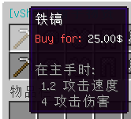
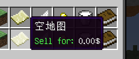
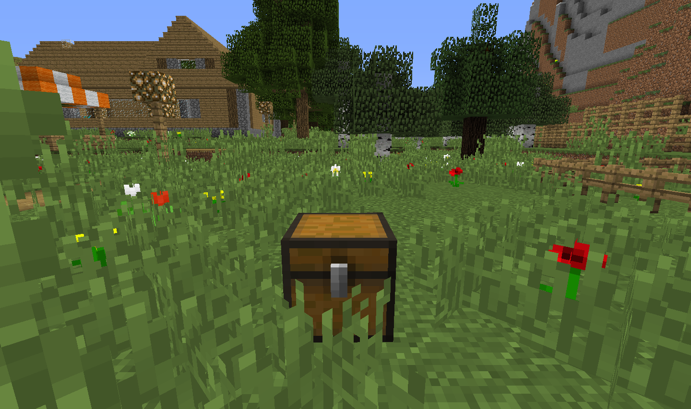
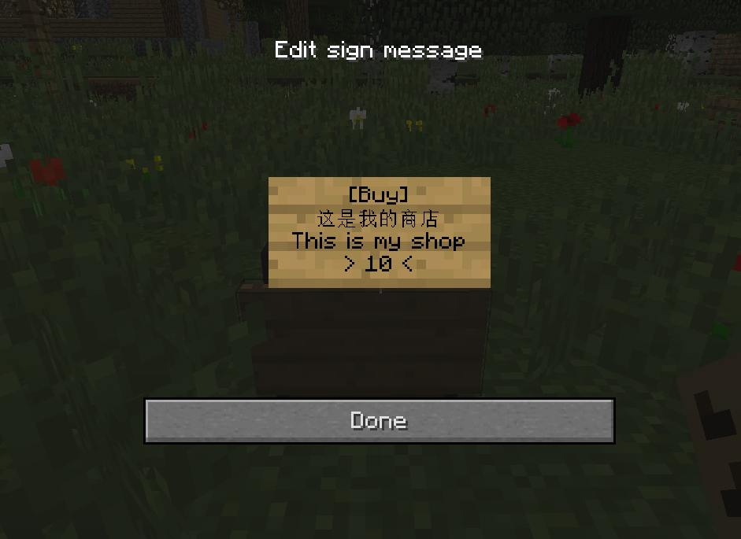

# 经济

## 购买&出售物品

您可以在服务器的新手村、轻轨站或地铁站找到售卖物品的村民，右键他们即可与他们进行交易。

上面一行即是购买，后面的价格代表要扣除的价格。直接点击后即可扣除，需要注意的是不支持退款。而售出不建议在村民那里售出，您可以去「煎蛋商店」去售出您的矿物等。「煎蛋商店」可以乘坐轻轨&地铁 1 号线从新手村出发即可。

如果您发现了「Sell for: 0.00$」的情况，这代表不提供出售服务。因此，建议您不要点击这样的售出，否则您的物品将丢失，而您将一点也获取不到。

### 创建您自己的商店

创建您自己的商店无需缴纳任何税费，只要您的货物足够即可。您将需要以下材料：

* 一个箱子
* 一个牌子
* 货物

如图，在空地上放上一个箱子：

然后，使用牌子放置在这个箱子上，并在牌子上输入如下内容：

> \[Buy\]
>
> 任意信息
>
> 任意信息
>
> 价格（必须整数）

如图：

这样即可创建一个「售出」商店，您可以定期往箱子里补货，这样，每当玩家购买了您箱子内的物品，您便可以增加您定义的余额，以此类推。

如果您将 \[Buy\] 更改为 \[Sell\]，则属于「收购」，收购商店不需要有存货，但是需要您有足够的钱财，这样才能让玩家卖给您东西，而您需要付款给玩家，但是不需要担心，这一切都是自动的。

当为 \[Sell\] 类型商店时，玩家每在您商店售出一个物品，您都要支付您的定价，而玩家的物品将会显示在箱子您供您获取。

  

