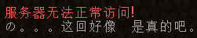

# 问题答疑

## 典型问题/报错

### 为什么打开客户端提示要下载?

为了方便起见，我们并没有预先下载 asset 文件，因此，您必须「自动」下载 asset 文件，没关系，您仅需等几分钟，便以后再也不需要下载，即可进入游戏了。

### 为什么进入服务器会闪退?

请检查您的 Java 内存设定，由于我们是 Mod 服务器，因此内存设定不得低于 1024。

如果您设定超过 1024 但是提示「是 32 位 Java」，请检查您的系统架构（右键单击「我的电脑/计算机/这台电脑/此电脑」，后选择「属性」，查看是「32 位操作系统」还是「64 位操作系统」）。如果您的系统是 32 位，很抱歉，您可能很难进入服务器。

如果您的系统是 64 位，请确定您的 Java 是否是在 java.com 下载的。若是，则请移步至 Java 的 [Technet](http://www.oracle.com/technetwork/java/javase/downloads/jdk8-downloads-2133151.html%29) 下载 64 位版本 Java。

### 为什么刷新服务器后提示「当前无法正常访问!」?

若显示如图的信息，请不要在意，这只是一个玩笑哦。「像」和「是」中间有一个黑色的「不」，也许您细心以后就可以发现呢！

但是如果直接显示「无法连接到服务器」的话，如果此时仍然有玩家在游玩的话，那么请检查您的网络，否则可能是服务器暂时故障或者维护。

### 为什么加入服务器后提示「Invalid username」?

请检查您的名称是否符合如下需求：

* 是英文字母。
* 是数字。
* 位数在 2~16 之间。

如果不符合，请更改您的名称以符合此需求，另外，我们的服务不支持以中文作用户名。

### 为什么会突然断线提示「Connection reset by peer」?

这是正常现象，您只需要重新进入服务器即可。

### 为什么加入服务器后提示「No further information」?

如果您使用的是 Windows 系统，则很有可能您对服务器的连接被系统防火墙阻止了，您必须允许「共享」。

这需要您在网络共享中心的网络属性中进行手动配置。

### 为什么启动器启动失败，报错信息含有「Unable to download」?

您目前的网络状况不适合从官方下载源下载文件（因为官方的服务器在外国）。

因此，您可以手动点击「启动器设置」&gt;「下载源」，将下载源从「官方」更换为「BMCLAPI」后重新尝试启动游戏即可。

###  

